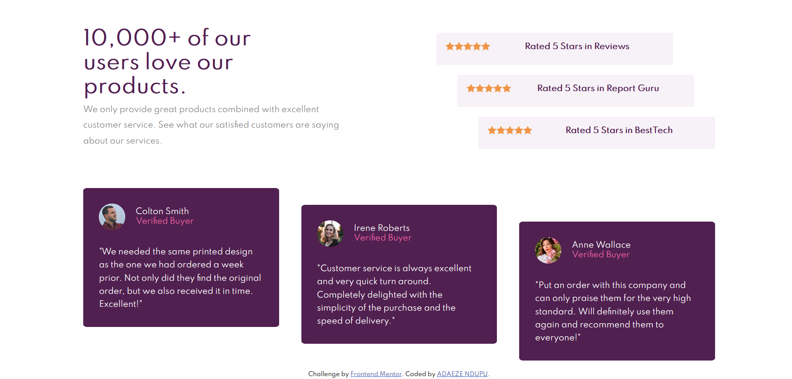
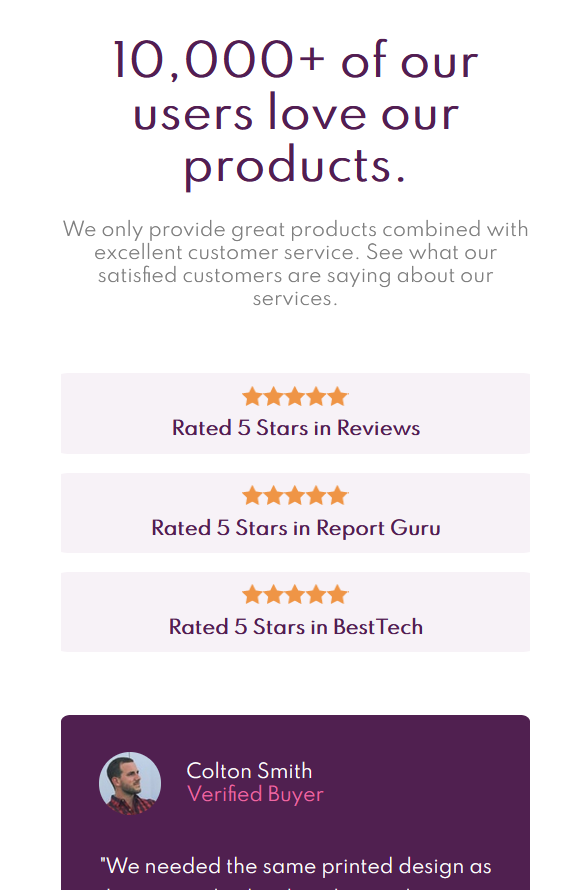
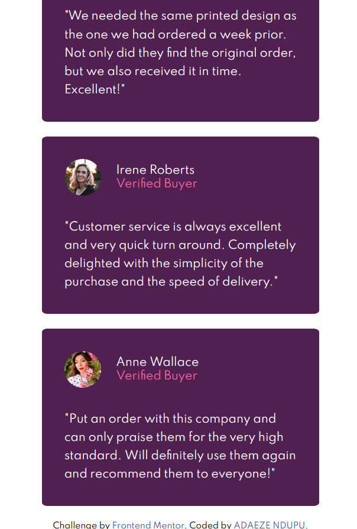

# Frontend Mentor - Social proof section

## Welcome! 👋

Thanks for checking out this front-end coding challenge.

[Frontend Mentor](https://www.frontendmentor.io) challenges help you improve your coding skills by building realistic projects.

**To do this challenge, you need a basic understanding of HTML and CSS.**
# Frontend Mentor - Social proof section solution

This is a solution to the [Social proof section challenge on Frontend Mentor](https://www.frontendmentor.io/challenges/social-proof-section-6e0qTv_bA). Frontend Mentor challenges help you improve your coding skills by building realistic projects.

## Table of contents

- [Overview](#overview)
    - [The challenge](#the-challenge)
    - [Screenshot](#screenshot)
    - [Links](#links)
- [My process](#my-process)
    - [Built with](#built-with)
- [Author](#author)

## Overview

### The challenge

Users should be able to:

- View the optimal layout for the section depending on their device's screen size

### Screenshots

### Links

- Live Site URL: [Social Proof Section](https://vermilion4.github.io/social-proof-section/)

## My process

### Built with

- Semantic HTML5 markup
- CSS custom properties
- Flexbox
- CSS Grid
- Mobile-first workflow

## Author

- Website - [vermilionhost](https://www.vermilionhost.site)
- Frontend Mentor - [@vermilion4](https://www.frontendmentor.io/profile/vermilion4)
- Github - [vermilion4](https://github.com/vermilion4)
- LinkedIn - [Adaeze Ndupu](https://www.linkedin.com/in/adaeze-ndupu-31ab42176?lipi=urn%3Ali%3Apage%3Ad_flagship3_profile_view_base_contact_details%3B35uS0ATKTSiUyVj83jbmJA%3D%3D)

